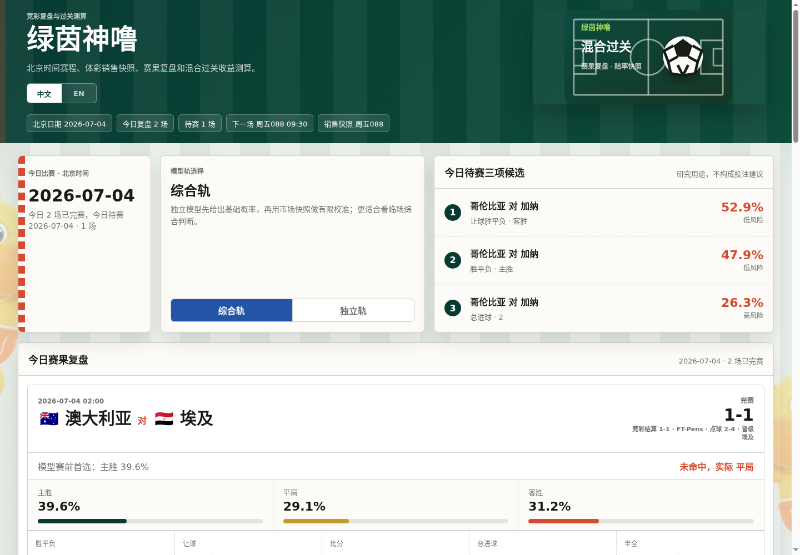

# 绿茵神噜 / Green Pitch Luloo

离线优先的世界杯预测与竞彩玩法测算网页。项目内置样例赛程、球队强度、赛果、市场快照和体彩销售快照；运行时先生成静态 JSON，浏览器只读取本地文件。默认模式不调用外部接口；如果启用自动赛程/赛果更新，生成器会在后台拉取 ESPN 公共 scoreboard 数据并重新生成静态 JSON。



## 功能

- 支持中文 / English 界面切换，语言偏好保存在浏览器本地。
- 展示待赛比赛预测、今日赛果复盘、全部赛程、历史命中率、冠军概率。
- 覆盖中国体彩竞彩足球常见玩法：胜平负、让球胜平负、比分、总进球、半全场。
- 独立玩法计算器支持同场多选、跨场混合过关、单注金额、注数、命中概率、最高返还和预计收益估算。
- 默认完全本地运行，适合个人电脑克隆后直接部署；服务器部署可开启定时自动赛程/赛果更新。

## 一键本地运行

```bash
git clone https://github.com/chuanfeng-he/worldcup-prediction.git
cd worldcup-prediction
make run
```

然后打开：

```text
http://127.0.0.1:8080
```

`make run` 会先执行数据生成，再启动本地静态服务。

## Docker 运行

```bash
git clone https://github.com/chuanfeng-he/worldcup-prediction.git
cd worldcup-prediction
docker compose up --build
```

然后打开：

```text
http://127.0.0.1:8080
```

## 常用命令

```bash
make test      # 运行测试
make generate  # 生成 public/data/*.json 和前端静态文件
make serve     # 启动本地服务
make run       # 生成并启动
make docker    # 使用 Docker Compose 启动
```

也可以直接使用 Python 模块：

```bash
python3 -m wcmodel.cli generate --sims 5000 --seed 2026
python3 -m wcmodel.cli serve --host 127.0.0.1 --port 8080
```

## 自动赛程/赛果更新

默认 `make generate` 只使用本地快照，结果稳定且可离线复现。需要自动更新赛程和赛果时，使用：

```bash
python3 -m wcmodel.cli generate --sims 5000 --seed 2026 --live-results espn
```

或直接运行脚本：

```bash
scripts/update_public.sh
```

服务器发布时可以把生成后的静态文件同步到 Web 根目录：

```bash
PUBLIC_TARGET=/path/to/public-web-root scripts/update_public.sh
```

建议在服务器上用 cron 或 systemd timer 每 5 分钟执行一次。更新器只在生成成功后同步 `public/`，浏览器仍然只读取静态 JSON。

项目提供了可选的 systemd 模板：

```bash
sudo cp deploy/systemd/worldcup-prediction-update.service /etc/systemd/system/
sudo cp deploy/systemd/worldcup-prediction-update.timer /etc/systemd/system/
sudo systemctl daemon-reload
sudo systemctl enable --now worldcup-prediction-update.timer
```

默认模板假设项目在 `/opt/worldcup-prediction`，静态站点发布到 `/var/www/worldcup-prediction`。如果部署路径不同，请先修改 service 文件里的 `WorkingDirectory` 和 `PUBLIC_TARGET`。

## 当前算法原理

### 1. 数据层

项目使用内置快照数据：

- 球队基础强度：Elo 分、结构化实力评分、阵容身价信号、是否主办地相关优势。
- 赛程与赛果：已完赛结果会被锁定，未赛比赛进入预测。
- 市场概率快照：用于综合轨的有限校准。
- 体彩销售快照：用于让球、开售状态、单场/过关规则和票面赔率展示。

这些数据都在本地代码中。自动赛程/赛果更新模式会用 ESPN 公共 scoreboard 补充已知球队的新赛程，并覆盖已完赛结果；它不改写球队强度、市场概率和体彩销售快照。
没有体彩销售快照的玩法默认视为未开售，不进入计算器和候选推荐，避免把模型兜底赔率误当成官方票面赔率。

### 1.1 自动赛程/赛果覆盖

启用 `--live-results espn` 后，生成器会拉取 ESPN 公共 scoreboard，按双方国家队缩写匹配本地赛程；如果 ESPN 返回了本地快照里还没有、但球队已在项目数据里的比赛，会自动追加为待赛项。写入页面时区分两种比分：

- 竞彩结算比分：按 90 分钟常规时间计算，用于胜平负、比分、总进球、半全场等复盘命中率。
- 最终赛果：保留加时、点球和晋级信息，用于页面展示。

例如淘汰赛如果 90 分钟 1:1、加时 3:2，复盘结算仍按 1:1，但卡片会显示最终 3:2 和晋级队伍。

### 2. 独立轨概率

独立轨不读取市场概率。它会综合：

- Elo 差值；
- 阵容结构评分；
- 阵容身价信号；
- 主客/中立场上下文；
- 比赛阶段上下文。

模型先得到胜、平、负的基础强度，再归一化为 `主胜 / 平局 / 客胜` 概率。

### 3. 进球分布

模型根据双方强度差、阵容信号和比赛上下文生成主队与客队的预期进球。随后使用泊松进球矩阵，并加入 Dixon-Coles 低比分修正，降低常见低比分相关性偏差。比分矩阵会被重新归一化，作为比分、总进球、让球胜平负、半全场等玩法的共同基础。

### 4. 综合轨概率

综合轨先使用独立轨结果，再在有市场概率快照时做有上限的校准。市场信号只影响 `accuracy_probs`，不会改写 `independent_probs`。这样页面可以同时对比“模型原始判断”和“结合市场后的判断”。

### 5. 竞彩玩法推导

- 胜平负：直接使用胜、平、负概率。
- 让球胜平负：在比分矩阵里给主队加上官方让球，再聚合为胜、平、负。
- 比分：按中国体彩比分桶聚合，包含常见精确比分以及胜其他、平其他、负其他。
- 总进球：把比分矩阵按总进球数聚合为 0、1、2、3、4、5、6、7+。
- 半全场：把全场预期进球拆成上半场和下半场两个矩阵，再组合半场结果与全场结果。

### 6. 候选推荐与计算器

每日候选按“命中概率 x 玩法风险权重”排序，偏向概率较高、波动较低的玩法。

计算器规则：

- 同一场比赛的多个选择视为备选项；
- 不同比赛之间按笛卡尔积组成过关组合；
- 注数 = 各场选择数相乘；
- 总本金 = 单注金额 x 注数；
- 成功率 = 各场备选命中概率之和再跨场相乘；
- 最高返还 = 所有组合中票面赔率乘积最高的一注 x 单注金额；
- 预计收益 = 各组合概率加权返还 - 总本金。

### 7. 冠军概率

冠军概率来自固定随机种子的 Monte Carlo 模拟。已完赛结果会被锁定，未赛部分按模型概率推进。当前赛程是演示快照，正式使用时可以替换为新的本地数据快照。

## 限制

- 这是研究和复盘工具，不保证赛果，不构成投注建议。
- 默认数据是本地样例快照，不是官方实时数据源。
- 自动更新可补充 ESPN 赛程和已完赛结果；竞彩销售规则、官方赔率快照和开售状态仍需要人工或后续数据源维护。

---

# English

Green Pitch Luloo is an offline-first World Cup prediction and football lottery calculator. It ships with local sample fixtures, team ratings, results, market snapshots and lottery sale snapshots. The Python worker generates static JSON, and the browser reads those local files only. By default no external API is required. If live fixture/result updates are enabled, the generator fetches ESPN public scoreboard data in the background and regenerates static JSON.

## Quick Start

```bash
git clone https://github.com/chuanfeng-he/worldcup-prediction.git
cd worldcup-prediction
make run
```

Open:

```text
http://127.0.0.1:8080
```

## Docker

```bash
git clone https://github.com/chuanfeng-he/worldcup-prediction.git
cd worldcup-prediction
docker compose up --build
```

Open:

```text
http://127.0.0.1:8080
```

## Model Summary

The independent track estimates match strength from Elo, structural team rating, squad-value signal, venue context and stage context. Expected goals are converted into a Poisson score matrix with Dixon-Coles low-score correction. The blended track starts from the independent probabilities and applies bounded calibration from available market snapshots.

Live fixture/result mode is optional:

```bash
python3 -m wcmodel.cli generate --sims 5000 --seed 2026 --live-results espn
PUBLIC_TARGET=/path/to/public-web-root scripts/update_public.sh
```

In live mode, matches are matched by national-team abbreviations. ESPN fixtures not present in the local snapshot are appended when both teams are known to the project. Lottery review uses regulation-time settlement scores, while the UI also keeps final score, extra-time, penalty and advancing-team metadata. China Sports Lottery sales rules, official odds snapshots and sale availability still come from local snapshots unless a dedicated data source is added.

Lottery markets are derived from the same probability layer:

- 1X2 uses home/draw/away probabilities.
- Handicap 1X2 aggregates the score matrix after applying the official handicap.
- Correct score maps the score matrix into listed score buckets plus home/draw/away other.
- Total goals aggregates scores into 0, 1, 2, 3, 4, 5, 6 and 7+.
- Half-time / full-time combines first-half and second-half score matrices.

The calculator treats same-match selections as alternatives and cross-match selections as parlay combinations. It computes bet count, total stake, hit probability, max return and expected profit from selected odds and probabilities.
